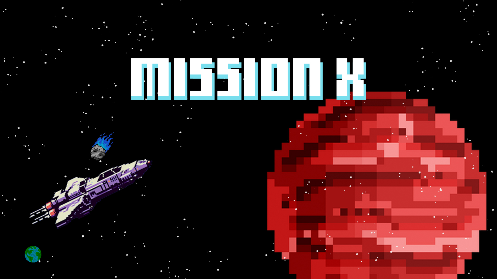

<h4 align="center"><a href="https://vitorkeller.itch.io/missionx">Clique para visitar o projeto</a></h4>

# Sobre o jogo.
Este jogo foi desenvolvido para a GameJam da Católica de Santa Catarina, com o tema "Sobrevivência e Suspense". Você assume o papel de Josh, o protagonista de uma jornada tensa e sombria. Preso em uma nave mergulhada na escuridão, ele precisa lutar contra o tempo para descobrir o que aconteceu com o restante da tripulação – e, mais importante, para sobreviver.

# Como fazer a instalação.
- 1° Faça o download da pasta Game.
- 2° Depois extraia a pasta no seu computador.
- 3° Inicie o arquivo MissionX.exe e se divirta.
